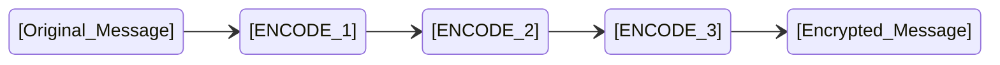
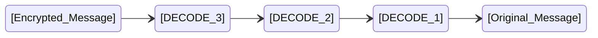

# Bounty Hunters - Secret Message

- [Bounty Hunters - Secret Message](#bounty-hunters---secret-message)
  - [Encrypted message](#encrypted-message)
  - [Encryption steps](#encryption-steps)
    - [ENCODE\_1](#encode_1)
    - [ENCODE\_2](#encode_2)
    - [ENCODE\_3](#encode_3)
  - [The task](#the-task)


The Local Wildlife Agency (LWA) got wind of your excesive hunting in the area. As such, they are ready to give you a penalty of 0.5 points to your capture this year. However, they agreed to let you attone for your mistakes. They encrypted three messages with three levels of encryption each (according to the diagram below). Your job is to decrypt the messages and follow the instructions written in them. If your team is the first one to succeed, each member will get a percentage of 1 point (depending on the contribution). Next teams that follow the instructions successfully will also get a bonus, but smaller than the team that followed the instructions before them.

## Encrypted message

The encrypted message is presented below:

*@qsi k@qd d@dr@x jiylct j@#t d@ y# k@qdj ki@fx fdgc@d@#kqkfy# (y#cp ki@ vfc@ sy#kqf#f#w ki@ gxys@tlx@). @qsi k@qd d@dr@x jiylct qcjy j@#t d@ ki@ cfjkf#w qjjysfqk@t nfki ki@ qjd vfc@. iqggp syttf#w! yi, q#t y#@ dyx@ kif#w: @qsi jklt@#k jiylct qcjy j@#t d@ y# k@qdj niqk qx@ ki@ mqcl@j f# @qsi w@#@xqc qlxgyj@ x@wfjk@x qvk@x xl##f#w ki@ niyc@ syt@ (q jsx@@#jiyk).*

This message is split into three parts in the `main.asm` file. Each message contains the following:
- lower case letters (these were subject to encryption)
- symbols (some resulted after encryption, some were in the message originally)

## Encryption steps
Each message was encrypted according to this diagram.



### ENCODE_1

For this encryption, a procedure was implemented that took as parameters:
- the address of a `$`-terminated string
- the address of the length of the string, without the `$` character
- the address of a byte sized number (the encryption key)

The procedure parsed the message and added the encryption key to all letters in the message. If, after the encryption, some letters landed outside the `['a' - 'z']` interval, an adjustment was made, according to the formula `ch - 'z' + 'a'`, where `ch` is the character, after the addition of the encryption key (in case that character is greater than `'z'`).

The call for this procedure was:
```assembly
PUSH OFFSET MESSAGE1
PUSH OFFSET MSG1_LEN
PUSH OFFSET KEY1
CALL ENCODE_1
```
and the body of this procedure was:
```assembly
ENCODE_1 PROC NEAR
    PUSH BP
    MOV BP, SP
    MOV SI, [BP + 6]
    XOR CX, CX
    MOV CL, [SI]
    MOV SI, [BP + 4]
    MOV BL, [SI]
    MOV SI, [BP + 8]
    POP BP

    lbl1:
        MOV BH, [SI]
        CMP BH, 'a'
        JB next
        CMP BH, 'z'
        JA next
        ADD BH, BL
        CMP BH, 'z'
        JNAE next
        SUB BH, 'z'
        ADD BH, 'a'    
        next:
            MOV [SI],BH
            INC SI
    LOOP lbl1

    RET 6
ENCODE_1 ENDP
```

### ENCODE_2

For this encryption, a procedure was implemented that took as parameters:
- the address of a `$`-terminated string
- the address of the length of the string, without the `$` character
- the address of a byte sized vector (the first encryption key) of two elements where:
  - the first element is the replacing charachter (a symbol)
  - the second element is the character that should be replaced  (a lower case letter)
-  the address of a byte sized vector (the second encryption key) of two elements where:
   -  the first element is the replacing charachter (a symbol)
   -  the second element is the character that should be replaced (a lower case letter)
  
Yes! This encryption was done with two encryption keys!

The procedure parsed the message resulted from `ENCODE_1` and replace all occurences of the two characters to be replaced with the symbol they each needed to be replaced with. For example, if a key is `&j` then all occurences of `j` will be replaced with `&`.

The call for this procedure was:
```assembly
PUSH OFFSET MESSAGE1
PUSH OFFSET MSG1_LEN
PUSH OFFSET KEY2_1
PUSH OFFSET KEY2_2
CALL ENCODE_2
```
and the body of the procedure was:
```assembly
ENCODE_2 PROC NEAR
    PUSH BP
    MOV BP, SP
    MOV SI, [BP + 8]
    XOR CX, CX
    MOV CL, [SI]
    MOV SI, [BP + 4]
    MOV AH, [SI]
    MOV AL, [SI + 1]
    MOV SI, [BP + 6]
    MOV BH, [SI]
    MOV BL, [SI + 1]
    MOV SI, [BP + 10]
    POP BP

    lbl2:
        MOV DL, [SI]
        l_key2_1:
            CMP DL, BL
            JNE l_key2_2
            MOV DL, BH
            JMP next2
        l_key2_2:
            CMP DL, AL
            JNE next2
            MOV DL, AH
            JMP next2
        next2: 
            MOV [SI], DL
            INC SI
    LOOP lbl2

    RET 8
ENCODE_2 ENDP
```

### ENCODE_3

For this encryption, a procedure was implemented that took as parameters:
- the address of a `$`-terminated string
- the address of the length of the string, without the `$` character
- the address of a byte sized vector (the first encryption key) of two elements, each of them a lower case letter
- the address of a byte sized vector (the second encryption key) of two elements, each of them a lower case letter

Yes! This encryption was also done with two encryption keys!

The procedure parsed the message resulted from `ENCODE_2` and swaps the letters given by the keys. For example, if a key is `ax` all occurences of `a` become `x` and all occurences of `x` become `a`. This is done in a single pass over the string.

The call for this procedure was:
```assembly
PUSH OFFSET MESSAGE1
PUSH OFFSET MSG1_LEN
PUSH OFFSET KEY3_1
PUSH OFFSET KEY3_2
CALL ENCODE_3
```
and the body of the procedure was:
```assembly
ENCODE_3 PROC NEAR
    PUSH BP
    MOV BP, SP
    MOV SI, [BP + 8]
    XOR CX, CX
    MOV CL, [SI]
    MOV SI, [BP + 4]
    MOV AH, [SI]
    MOV AL, [SI + 1]
    MOV SI, [BP + 6]~
    MOV BH, [SI]
    MOV BL, [SI + 1]
    MOV SI, [BP + 10]
    POP BP

    lbl3:
        MOV DL, [SI]
        l_key3_1_1:
            CMP DL, BL
            JNE l_key3_1_2
            MOV DL, BH
            JMP next3
        l_key3_1_2:
            CMP DL, BH
            JNE l_key3_2_1
            MOV DL, BL
            JMP next3
        l_key3_2_1:
            CMP DL, AL
            JNE l_key3_2_2
            MOV DL, AH
            JMP next3
        l_key3_2_2:
            CMP DL, AH
            JNE next3
            MOV DL, AL
            JMP next3
        next3: 
            MOV [SI], DL
            INC SI
    LOOP lbl3

    RET 8
ENCODE_3 ENDP
```

## The task

In order to not receive a penalty from the LWA, your team needs to implement three decoding procedures (`DECODE_1`, `DECODE_2`, and `DECODE_3`) that each decode their respective encodings. For example, `DECODE_1` will decode the message encoded by `ENCODE_1`. The diagram below explains how you should apply the decoding steps.

