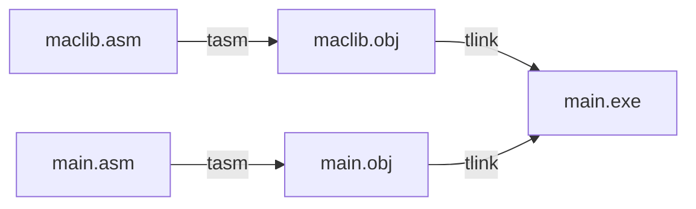
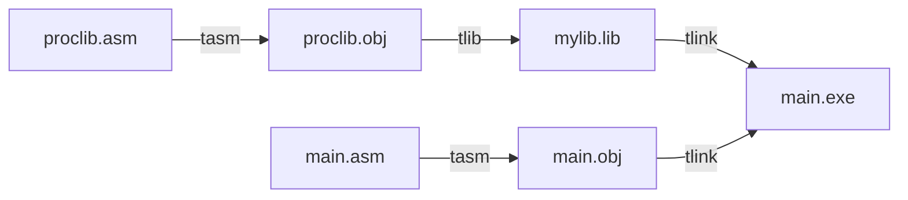

# Working with macros and libraries <!-- omit in toc -->

## Table of contents <!-- omit in toc -->
- [Working with macros](#working-with-macros)
- [Macro library](#macro-library)
- [Procedure library](#procedure-library)
  - [More options for `TLIB`](#more-options-for-tlib)

## Working with macros
A macro is a pseudo-operation that allow the reuse of previously written code. They are similar to procedures, but there are also some differences.

Macros | Procedures
---|---
when called, it will **expand** *in place* with the macro body | when called, it will **modify** the instruction pointer to *jump* to the procedure body
**does not** modify the flow of instructions | **does** modify the flow of instructions
can be grouped in **macro libraries** | can be grouped in **procedure libraries**

> **Note** 
> A *macro library* contains unassambled source code and **must** be included in the program in which a macro from the library is used (with the `INCLUDE` instruction).

> **Note**
> A *procedure library* contains object code (i.e. assambled procedures) which are referred to the link-edit.

To declare and implement a macro, use the following syntax:
```assembly
MACRO_NAME  MACRO [PARAMETER LIST] ; parameters are separated by commas
    LOCAL   [LABEL LIST] ; labels are separated by commas
    ; macro body
ENDM
```
The **local label list** is optional. Macros that use labels inside them, must declare those labels in this list. These labels are then expanded with different names each time the macro is called.

## Macro library
A macro library is nothing more than multiple macros defined in the same soure (`.asm`) file. This file is the included in the main one with the `INCLUDE filename.asm` instruction.

Below is the sequence of steps used to assemble and link a macro library to the main file. (`maclib.asm` is the assembly file that contains the macro definitions and `main.asm` is the main file that calls on those macros.)


```
C:\TASM>tasm maclib.asm
C:\TASM>tasm main.asm
C:\TASM>tlink main.obj maclib.obj
C:\TASM>td main.exe
```

## Procedure library
A procedure library start as multiple procedures defined in a code segment. This file is then assembled, and the resulting object file is used with the `tlib` instruction to create a library. This library is then linked with the object generated by the main file.

Below is the sequence of steps to create, assemble and link a procedure library to the main file.


```
C:\TASM>tasm /zi proclib.asm
C:\TASM>tlib mylib.lib +proclib.obj
C:\TASM>tasm /zi main.asm
C:\TASM>tlink /v main.obj mylib.lib
C:\TASM>td main.exe
```

### More options for `TLIB`
The instruction `tlib` is called as follows:
```
tlib [library_name] {+,-,*}[module_name]
```
where:
- `+` is used to add a module (`.obj` file) to the library
- `-` is used to remove a module from the library
- `*` is used to extract a module from the library

