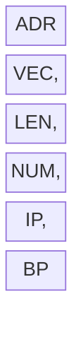

# Procedures, Macros, and Libaries

In this Tudorial we'll cover the following topics:

<!-- table of contents -->

Before starting with any topic, the current Tudorial makes the following assumptions:
- parameters are passed via the stack to the procedures
- the addresses of variables are passed as parameters (not the values)
- for all procedures, it is assumed that the caller is the `START` procedure

All procedures will solve the following task:
*Given the address of a vector of bytes, the address of it's length and the address of another byte sized number, write a procedure that adds the byte sized number to all odd elements of the vector.*

## Writing a near type procedure in the same segment as the caller
Starting from the code in `template.asm`, define your data segment as described in the task.
https://github.com/tudorcoroian17/ALP/blob/ae6ff8885bb304503d27819b06bfd619b8350695/resources/line-code/npss.asm#L1-L5

Next, write the header of the procedure, after the end of the `START` procedure.
https://github.com/tudorcoroian17/ALP/blob/ae6ff8885bb304503d27819b06bfd619b8350695/resources/line-code/npss.asm#L23-L25

Since we know that the procedure takes 3 parameters as arguments, you can write the end of the procedure.
https://github.com/tudorcoroian17/ALP/blob/ae6ff8885bb304503d27819b06bfd619b8350695/resources/line-code/npss.asm#L56-L57

It's important to know the order of the parameters sent via the stack. The task specifies that the address of the vector is sent first, then the length, and then the number. Push these values on the stack in the `START` procedure and then call `REPLACE_EVEN`.
https://github.com/tudorcoroian17/ALP/blob/ae6ff8885bb304503d27819b06bfd619b8350695/resources/line-code/npss.asm#L15-L23

Now that we know the order of the parameters, you can start extracting the values from the stack.

First, to avoid unexpected behaviour, save the value of `BP` on the stack, in order to be able to retrieve it later, once you don't need `BP` anymore. This should be the first instruction in the procedure.
https://github.com/tudorcoroian17/ALP/blob/ae6ff8885bb304503d27819b06bfd619b8350695/resources/line-code/npss.asm#L25-L26

Second, copy the value of `SP` in `BP`, to be able to extract the parameters from the stack, without using the `POP` instruction.
https://github.com/tudorcoroian17/ALP/blob/ae6ff8885bb304503d27819b06bfd619b8350695/resources/line-code/npss.asm#L28

Now begin to extract the parameters from the stack. The order is arbitrary, so let's start with the length of the vector. Keep in mind that since you pushed `BP` on the stack, it now looks like below.

