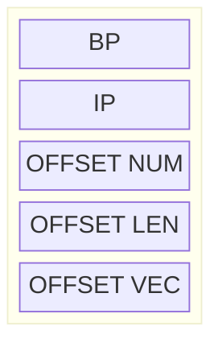

# Procedures, Macros, and Libaries

In this Tudorial we'll cover the following topics:

<!-- table of contents -->

Before starting with any topic, the current Tudorial makes the following assumptions:
- parameters are passed via the stack to the procedures
- the addresses of variables are passed as parameters (not the values)
- for all procedures, it is assumed that the caller is the `START` procedure

All procedures will solve the following task:
*Given the address of a vector of bytes, the address of it's length and the address of another byte sized number, write a procedure that adds the byte sized number to all odd elements of the vector.*

## Writing a near type procedure in the same segment as the caller
Starting from the code in `template.asm`, define your data segment as described in the task.
https://github.com/tudorcoroian17/ALP/blob/ae6ff8885bb304503d27819b06bfd619b8350695/resources/line-code/npss.asm#L1-L5

Next, write the header of the procedure, after the end of the `START` procedure.
https://github.com/tudorcoroian17/ALP/blob/ae6ff8885bb304503d27819b06bfd619b8350695/resources/line-code/npss.asm#L23-L25

Since we know that the procedure takes 3 parameters as arguments, you can write the end of the procedure.
https://github.com/tudorcoroian17/ALP/blob/ae6ff8885bb304503d27819b06bfd619b8350695/resources/line-code/npss.asm#L56-L57

It's important to know the order of the parameters sent via the stack. The task specifies that the address of the vector is sent first, then the length, and then the number. Push these values on the stack in the `START` procedure and then call `REPLACE_EVEN`.
https://github.com/tudorcoroian17/ALP/blob/ae6ff8885bb304503d27819b06bfd619b8350695/resources/line-code/npss.asm#L15-L23

Now that we know the order of the parameters, you can start extracting the values from the stack.

First, to avoid unexpected behaviour, save the value of `BP` on the stack, in order to be able to retrieve it later, once you don't need `BP` anymore. This should be the first instruction in the procedure.
https://github.com/tudorcoroian17/ALP/blob/ae6ff8885bb304503d27819b06bfd619b8350695/resources/line-code/npss.asm#L25-L26

Second, copy the value of `SP` in `BP`, to be able to extract the parameters from the stack, without using the `POP` instruction.
https://github.com/tudorcoroian17/ALP/blob/ae6ff8885bb304503d27819b06bfd619b8350695/resources/line-code/npss.asm#L28

Now begin to extract the parameters from the stack. Keep in mind that since you pushed `BP` on the stack, it now looks like below.

The order is arbitrary, so let's start with the length of the vector. Since on the stack we find the offset (or relative address) of the length of the vector, extract this address in the `SI` register. Furthermore, since we know that this length will be used for the `LOOP` instruction, we should copy the value of `LEN` from the data segment into `CX`.
https://github.com/tudorcoroian17/ALP/blob/ae6ff8885bb304503d27819b06bfd619b8350695/resources/line-code/npss.asm#L29-L33
We used `[BP + 6]` since on top of the address of `LEN`, in the stack, there is the address of `NUM`, `IP` and `BP` (the original value of `BP`).

Now, let's extract the value of `NUM` and place it in `DL`. Remember that on the stack, we find the offset of `NUM`, so you should extract this value and put it in `SI`. Then, use the `SI` register as an index in the data segment to copy the value of `NUM` in `DL`.
https://github.com/tudorcoroian17/ALP/blob/ae6ff8885bb304503d27819b06bfd619b8350695/resources/line-code/npss.asm#L33-L37
We used `[BP + 4]` since on top of the address of `NUM`, in the stack, there is `IP` and `BP` (the original value of `BP`).

Lastly, let's extract the address of `VEC` and place in in `SI`, since we know that we want to use `SI` to access each element of the vector, inside the loop.
https://github.com/tudorcoroian17/ALP/blob/ae6ff8885bb304503d27819b06bfd619b8350695/resources/line-code/npss.asm#L37-L39

We won't use the `BP` register anymore, so we can restore it's old value.
https://github.com/tudorcoroian17/ALP/blob/ae6ff8885bb304503d27819b06bfd619b8350695/resources/line-code/npss.asm#L39-L41

Let's finish this procedure, by writing the `LOOP` instruction, together with the code for each iteration in one go.
https://github.com/tudorcoroian17/ALP/blob/ae6ff8885bb304503d27819b06bfd619b8350695/resources/line-code/npss.asm#L42-L54

The address of `VEC` is now in `SI`. When incrementing `SI`, it will point to the next byte in `VEC`. Since all elements of `VEC` are bytes, `SI` will actualy point to the next element, after the increment.

Moving each element in `AL` and the applying the AND-mask `01H` will isolate in `AL` the last bit of the element of the vector. Since the last bit tells us if the number is even or odd, we should compare the result in `AL` with `01H`. We don't want to modify even values, so when `AL` is not equal to `01H` (i.e., the number is even), we should jump to the `even:` label.

When the number is odd, we want to add `NUM` (whose value is now in `DL`) directly to the element in vector (which is at `[SI]`).

### The complete solution
https://github.com/tudorcoroian17/ALP/blob/ae6ff8885bb304503d27819b06bfd619b8350695/resources/line-code/npss.asm#L1-L60

