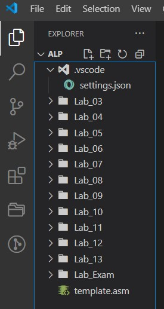

# ALP
Teaching materials for ALP at UTCN (1st year- 2nd semester)

# Tudorials
You'll find a list of "Tudorials" below, aimed to help you install, setup and use the tools needed for this laboratory.

## Install Visual Studio Code
In order to install VSCode on your local machine, follow the steps below.

1. Press the windows key (in general, between the left `CTRL` and `ALT`) and type `Microsoft store`. Click `ENTER` to open Microsoft Store.
2. In the newly opened window, type `vs code` in the search bar. Select the `Visual Studio Code` application (blue ribbon icon).
3. Click the `Install` button and wait for the application to install.

Congrats! You have now installed **VSCode** on your local machine!

## Setup your working directory
This section will show you how to create a working directory and perform the necessary setup in order to run the assembly applications with just a click of a button.

1. Create a folder anywhere you want. For simplicity, name it `ALP`.
2. Open the folder and go to the path bar. Delete everything and type `cmd`. This will open the command prompt within your current directory.
3. In the command prompt, type `code .` to open **VSCode** in your current directory.
4. Close the command prompt after VSCode has started.
5. If prompted with a security warning, choose **I trust the authors [...]**.
6. Using **VSCode**, create a new directory called `.vscode` inside your recently open workspace `ALP`.
7. Using **VSCode**, create a new file called `settings.json` inside the previously created folder (`.vscode`).
8. Paste the contents shown below in this newly created file. This will allow you to run/debug assembly application by simply right-clicking inside the file in which the code is written and choosing the appropriate option (*Run* or *Debug*). You will need to make changes in this file once we start running assembly code from multiple source files. This topic will be present in another "Tudorial".
```json
{
    "masmtasm.ASM.emulator": "dosbox",
    "masmtasm.ASM.mode": "single file",
    "masmtasm.ASM.actions": {
        "TASM": {
            "baseBundle": "<built-in>/TASM.jsdos",
            "before": [
                "set PATH=C:\\TASM",
            ],
            "run": [
                "TASM /m2 ${file}",
                "TLINK ${filename}",
                ">${filename}"
            ],
            "debug": [
                "TASM /m2 /zi ${file} ${filename}.obj",
                "TLINK /v/3 ${filename}.obj",
                "TD ${filename}.exe"
            ]
        }
    },
    "masmtasm.ASM.assembler": "TASM"
}
```
9.  Using **VSCode**, create a directory for each laboratory, under the workspace directory (`ALP`). In order to avoid confusion and to keep things easy, name your directories `Lab_XX`, where `XX` is replaced by the number of the laboratory (e.g., 01, 02, ..., 09, 10, a.s.o). You should create a total of **13 folders**, starting from `Lab_03` up until `Lab_13`. All these folders should be under the `ALP` directory.
10. Using **VSCode**, create a directory for the laboratory exam, under the workspace directory (`ALP`), named `Lab_Exam`. You should keep this folder empty until the day of the lab exam :D.
11. Using **VSCode**, create a file called `template.asm`, under the workspace directory (`ALP`). Paste the code below inside this file. This is to make sure that you will always have this starting template for your assembly code at hand.
```assembly
DATA SEGMENT PARA PUBLIC 'DATA'

DATA ENDS

; Macro declaration zone

; End of macro declaration zone

CODE SEGMENT PARA PUBLIC 'CODE'
ASSUME CS:CODE, DS:DATA
START PROC FAR
PUSH DS
XOR AX, AX
MOV DS, AX
PUSH AX
MOV AX, DATA
MOV DS, AX
; your code starts here

; your code ends here
RET
START ENDP

; Near procedures declaration zone

; End of near procedures declaration zone

CODE ENDS
END START
```
> [!WARNING]  
> The code inside this file can be used as a starting point. It should not be ran or debugged using the **TurboDebugger** or the **TASM/MASM** VSCode extension.
    
If you've completed all steps correctly, the structure of your workspace should match the image below.



Congrat! You have set up your workspace successfully!

## Install the `TASM/MASM` VSCode extension
The `TAMS/MASM` VSCode extension is the one that emulates the **TurboDebuger** from within Visual Studio Code. In order to install it, follow the steps below.

1. Open **VSCode** in the same manner as you opened it for the **Setup your working directory** Tudorial.
2. Go to the `Extensions` menu on the left (should be the forth one down) or press `CTRL + SHIFT + X`.
3. Search for the following extensions and install them:
   - ASM Comment Alligner
   - Binary Viewer 
   - MASM/TASM

Congrats! You have succesfully installed the necessary extensions for this laboratory!
